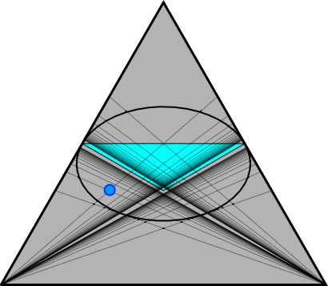

# Reflections of Representations

In the theory of quiver representations, a big hurdle is visualizing problems in this field. Although the subject is connected to areas such as algebraic geometry, quiver representations often remain more abstract than many other mathematical fields. One way to make representations of smaller quivers more concrete is to display their dimension vectors in a barycentric simplex.

This project provides an interactive simplex visualization for one specific quiver: the Kronecker chain of length 2. This quiver has three vertices, with two arrows from the first vertex to the second and two arrows from the second to the third. The application lets users enter dimension vectors and reflection sequences, then inspect the resulting vectors, quiver orientations, and related geometric structures.

These visualizations are practical only for small quivers, since the dimension of the simplex is one less than the number of vertices. Studying three-vertex quivers in detail is likely to provide insights that can be generalized to larger quivers.

## Features

The main feature of this project is an interactive Plotly diagram of a barycentric simplex. It includes:

- Reflected vectors of user-provided dimension vectors according to user-provided reflection sequences
- Polygons connecting the vectors created at each step of a reflection sequence
- Distinction between dimension vectors over the Kronecker chain and vectors over differently oriented quivers
- Lines between orthogonal pairs
- Exceptional dimension vectors associated with orthogonal pairs
- The fundamental domain and the ellipse defined by the quadratic form
- Reflections of the lines according to the supplied sequences
- The option to display each sequence in a separate simplex or all sequences in one simplex

Below the diagram, the application displays the vectors created at each step of the user-provided sequences, together with the current orientation of the quiver.

## Installation
### Method 1 (online)
The online version is available at https://reflections.streamlit.app.

### Method 2 (local)
Requires Python 3.12 or newer.  
Clone this repository and install the requirements in a virtual environment:
#### Linux / MacOS
```bash
git clone https://github.com/pjent01/Reflections-of-Representations.git
cd Reflections-of-Representations
python3 -m venv .venv
source .venv/bin/activate
python -m pip install -r requirements.txt
```
#### Windows
```cmd
git clone https://github.com/pjent01/Reflections-of-Representations.git
cd Reflections-of-Representations
python -m venv .venv
.venv\Scripts\activate
python -m pip install -r requirements.txt
```

Then start the application with:
```bash
python -m streamlit run main.py
```

## Using the Interface
Input a dimension vector with three coordinates for a representation of the Kronecker chain of length 2. Each component of a vector
should be separated by space and each new vector should be written in a new line. After confirming the input with `Ctrl + Enter`, the 
input vectors are displayed in the simplices below the controls. 

In the second field, you can enter sequences of reflections. Each sequence should be written as a continuous string of numbers. Each
new sequence should be either written in a new line or separated by space. The sequences generate new vectors from the given ones.
The reflections can change the orientation of the underlying quiver. When `Color` is activated, those vectors with underlying quiver 
the Kronecker chain of length 2 are displayed in green, while those over a quiver with different orientation are displayed in red. 

There are two modes for this program. 
Normally, there is one simplex per sequence, in which all vectors generated by this sequence are displayed. However, when
`One simplex for all sequences` is active, only a single simplex is generated. It contains all vectors generated by any of the sequences.
They are not separated by sequence.

### Visualization Options
#### Color
When active, distinguishes vectors based on the orientation of the underlying quiver. Green for the Kronecker chain, red for a different
orientation.

#### Show dimension vectors of differently oriented quivers
When active, displays all dimension vectors, including those over a quiver of different orientation. Otherwise, only the vectors displayed
in green are shown.

#### Connect vectors for each step
When active, after each reflection step in a sequence, all vectors generated in this step are connected by a line to form a polygon. 
Such polygons occur for certain dimension vectors. This option is meant to help visualize these cases. However, it may also be useful for 
tracking which vectors are generated by the same reflections.

#### Show lines between orthogonal vectors
Some dimension vectors form so-called orthogonal pairs. These each generate a category, which, in the case of this visualization, forms 
a line between both vectors in the pair. This option displays these lines.

Since there are infinitely many lines, it is possible to adjust how many lines should be generated. While even a large number of lines can
be displayed accurately, increasing the number of lines harms performance significantly.

#### Show lines reflected in each step
When active, show the lines that are generated by the reflection sequences within the ellipse. Within the ellipse, all lines are Schur and
are therefore displayed in light blue. At least for my purposes, only the parts of the reflected lines that are within the ellipse were relevant. 
For the sake of clarity, only these parts are displayed.

### Exceptional Sequences Options
#### Input how many different exceptional sequences should be generated
This number adjusts on how many of the lines the exceptional dimension vectors should be displayed. Large numbers may harm performance.

#### Input how many exceptional vectors should be generated per exceptional sequence
Each line contains infinitely many exceptional dimension vectors. This number adjusts how many should be displayed. Large numbers may
harm performance.

#### Highlight exceptional vectors
This option allows to highlight the exceptional dimension vectors in a cyan color for better visibility.

### Simplex Diagrams
Below the UI controls, the Plotly diagrams are generated. If too many sequences are given in the earlier input, the size of the simplices may 
decrease drastically. 

### Text output
Below the diagrams, there is a text output for the vectors generated after each step of the sequences, one column per sequence. The option 
`Show Quiver Orientation` may be activated to display the underlying quiver next to each block of dimension vectors. Again, when `Color` is active,
The blocks for the dimension vectors over the Kronecker chain are displayed in green and those over a quiver of different orientation are displayed
in red.

## Mathematical Background
A <b>quiver</b> is a directed graph, consisting of a set of vertices and a set of arrows between them. This project is concerned with the so-called Kronecker chain of length 2:
<p align="center">
  <picture>
    <source media="(prefers-color-scheme: dark)" srcset="./docs/kronecker-chain-darkmode.svg">
    <source media="(prefers-color-scheme: light)" srcset="./docs/kronecker-chain-lightmode.svg">
    
  </picture>
</p>
For a <b>representation</b> of such a quiver, one assigns a vector space to each vertex and a linear map to each arrow. The <b>dimension vector</b> of a representation is the tuple of the dimensions of the vector spaces assigned to the vertices. In this case, the dimension vector is a triple of non-negative integers.


<p align="center">
  <picture>
    <source media="(prefers-color-scheme: dark)" srcset="./docs/simplex_123_darkmode.svg">
    <source media="(prefers-color-scheme: light)" srcset="./docs/simplex_123_lightmode.svg">
    
  </picture>
</p>